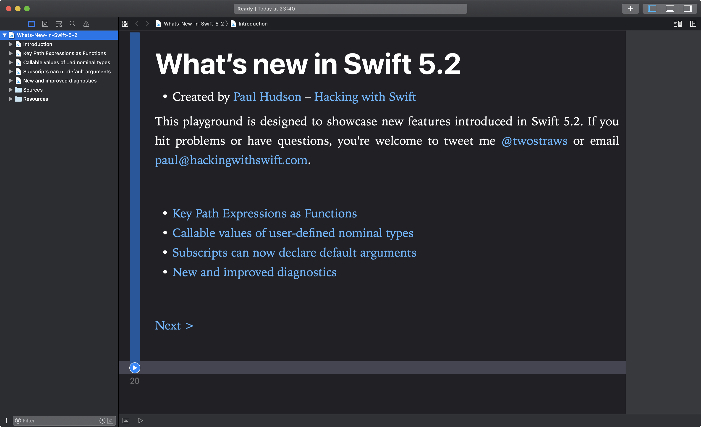

# What’s new in Swift 5.2?

This is an Xcode playground that demonstrates the new features introduced in Swift 5.2: 

* Key Path Expressions as Functions
* Callable values of user-defined nominal types
* Subscripts can now declare default arguments
* New and improved diagnostics

This is designed to complement my existing article [What’s New in Swift 5.2](https://www.hackingwithswift.com/articles/212/what-s-new-in-swift-5-2). You might also want to read [What’s New in Swift 5.1](https://www.hackingwithswift.com/articles/182/whats-new-in-swift-5-1) and [What’s New in Swift 5.0](https://www.hackingwithswift.com/articles/126/whats-new-in-swift-5.0) . Alternatively, I have a whole website dedicated to tracking [what's new in Swift](https://www.whatsnewinswift.com) – you should check it out at <https://www.whatsnewinswift.com>.

If you hit problems or have questions, you're welcome to tweet me [@twostraws](https://twitter.com/twostraws) or email <paul@hackingwithswift.com>.

